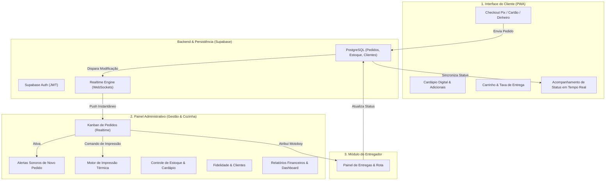

<div align="center">
  # ESPETINHO VITÓRIA
  
  **Ecossistema Completo de Gestão de Restaurantes, Delivery, Cardápio Digital e Impressão Térmica**

  [](https://react.dev/)
  [](https://developer.mozilla.org/)
  [](https://supabase.com/)
  [](https://vitejs.dev/)
  [](https://web.dev/progressive-web-apps/)
  [](https://espetinho-vitoria.vercel.app/menu)

</div>

---

## Visão Geral do Sistema

O **Espetinho Vitória** é uma solução omnichannel para estabelecimentos gastronômicos e operações de delivery. O ecossistema unifica o atendimento ao cliente via **Cardápio Digital PWA**, a operação de cozinha e balcão no **Painel Admin em Tempo Real** com suporte a **Impressão Térmica de Recibos**, e o gerenciamento de entregas pelo **Módulo de Entregadores**.

A arquitetura foi projetada sob três pilares estratégicos:
1. **Atendimento Autônomo e Fluidez (Self-Service)**: Cardápio responsivo com geração de QR Code, cálculo automático de taxa de entrega por bairro/distância e geração de chave Pix dinâmica com QR Code.
2. **Operação de Cozinha de Alta Performance**: Kanban reativo com atualização via WebSocket (Supabase Realtime), disparo de alertas sonoros a cada novo pedido e integração com impressoras térmicas (recibos de 58mm / 80mm).
3. **Gestão Estratégica e Fidelização**: Módulo de clientes com histórico de compras, programa de fidelidade por pontuação/pedidos, gestão de estoque de insumos e relatórios financeiros com Recharts.

---

## Demonstração da Interface (Screenshots)

### 1. Cardápio Digital e Fluxo do Cliente (Mobile PWA)

<div align="center">

| Tela Inicial do Cardápio | Categorias e Navegação |
|:---:|:---:|
|  |  |

| Detalhes do Produto (Açaí) | Seleção de Adicionais e Personalização |
|:---:|:---:|
|  |  |

</div>

<br>

### 2. Painel Administrativo e Gestão Operacional (Desktop)

<div align="center">

| Dashboard de Métricas Gerais | Kanban de Pedidos em Tempo Real |
|:---:|:---:|
|  |  |

| Gestão de Cardápio e Produtos | Controle de Estoque de Insumos |
|:---:|:---:|
|  |  |

| Relatórios Financeiros e Analytics | Gerador de QR Code para Mesas |
|:---:|:---:|
|  |  |

</div>

---

## Diagrama da Arquitetura do Ecossistema



---

## Principais Funcionalidades

### Módulo do Cliente (Cardápio Digital)
- **Cardápio Dinâmico**: Organização por categorias, variações de insumos e adicionais personalizáveis.
- **Cálculo de Frete Flexível**: Taxa de entrega calculada por bairro ou raio de distância.
- **Checkout Inteligente**: Opções de pagamento Pix (Chave / QR Code), Cartão na Entrega ou Dinheiro com cálculo automático de troco.
- **Status do Pedido**: Acompanhamento transparente das etapas (Pendente, Em Preparo, Saiu para Entrega, Concluído).
- **Horário de Funcionamento**: Trava automática de pedidos quando o estabelecimento está fechado.

### Módulo Administrativo (Gestão e Operação)
- **Kanban de Cozinha com Realtime**: Drag-and-drop de pedidos entre colunas operacionais com sincronização instantânea.
- **Impressão Térmica de Recibos**: Emissão de comprovantes para cozinha e cliente formatados para impressoras térmicas ESC/POS.
- **Alertas Sonoros**: Notificações em áudio diferenciadas para novos pedidos.
- **Programa de Fidelidade**: Gestão automática de pontos e bônus para clientes frequentes.
- **Controle de Estoque**: Baixa automática de ingredientes e alertas de item esgotado.
- **Gestão de Mesas e Comandas**: Suporte para atendimento presencial com controle de comanda por mesa e gerador de QR Code.
- **Relatórios de Desempenho**: Gráficos analíticos de faturamento diário/mensal, ticket médio e produtos mais vendidos.

---

## Tecnologias e Engenharia de Stack

### Frontend
- **React 19.2**: Utilização das APIs mais recentes do React para componentes reativos e alta fluidez de UI.
- **JavaScript ES2024**: Código moderno, modular e otimizado.
- **Vite 7.3**: Bundler ultrarrápido com Hot Module Replacement (HMR).
- **Recharts 3.7**: Biblioteca para renderização de gráficos estatísticos.
- **Lucide React**: Biblioteca de ícones vetoriais.
- **QRCode.React**: Gerador nativo de QR Codes para pagamentos Pix e mesas.
- **Vite Plugin PWA**: Suporte completo a Progressive Web App (PWA) para instalação no celular do cliente.

### Backend e Infraestrutura
- **Supabase PostgreSQL**: Banco de dados relacional com Row Level Security (RLS).
- **Supabase Realtime**: Transmissão WebSockets de alterações na tabela de pedidos em tempo real.
- **Supabase Auth**: Gerenciamento de acessos do painel administrativo e entregadores.
- **Vercel**: Deployment contínuo de alta disponibilidade.

---

## Estrutura do Projeto

```text
espetinho-vitoria/
├── src/
│   ├── components/       # Componentes reutilizáveis (Header, Navbar, Modais, ThermalReceipt)
│   ├── context/          # Context API global (StoreContext, AuthContext, ThemeContext)
│   ├── pages/            # Módulos organizados por perfil de acesso
│   │   ├── admin/        # Painel Administrativo (Orders, Menu, Customers, Inventory, Reports, Tables)
│   │   ├── customer/     # Cardápio Digital do Cliente
│   │   └── driver/       # Painel do Entregador
│   ├── services/         # Clientes de API e comunicação com Supabase
│   └── utils/            # Utilitários de formatação de moeda, impressão e Pix
├── public/               # Logotipos e ativos estáticos PWA
├── index.html            # Entry point com meta tags de SEO
├── vite.config.js        # Configuração do Vite e PWA Manifest
└── package.json          # Manifesto de dependências do projeto
```

---

## Instalação e Execução Local

### Pré-requisitos
- **Node.js**: `v18.0.0` ou superior
- **npm**: `v9.0.0` ou superior

### Passos para Instalação

1. **Clonar o Repositório:**
   ```bash
   git clone https://github.com/Alan-silva01/espetinho-vitoria.git
   cd espetinho-vitoria
   ```

2. **Instalar Dependências:**
   ```bash
   npm install
   ```

3. **Configuração de Variáveis de Ambiente:**
   Crie um arquivo `.env` com as credenciais do seu projeto Supabase:
   ```env
   VITE_SUPABASE_URL=sua_url_do_supabase
   VITE_SUPABASE_ANON_KEY=sua_chave_anonima_do_supabase
   ```

4. **Executar em Modo de Desenvolvimento:**
   ```bash
   npm run dev
   ```
   Acesse no navegador: `http://localhost:5173` ou veja a aplicação pública em `https://espetinho-vitoria.vercel.app/menu`.

5. **Gerar Build de Produção:**
   ```bash
   npm run build
   ```

---

<div align="center">
  <p>Desenvolvido por <strong>Alan Silva</strong> | Soluções em Automação e Software Empresarial</p>
</div>
